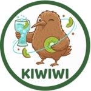

[](https://forms.gle/QrFAaXgbLnsxywhA7)

# kiwiwi

<div align="center">



The missing scaffold tool for [`Gin`](https://github.com/gin-gonic/gin) web framework.


</div>

# Table of contents

- [introduction](#introduction)
- [installation](#installation)
- [getting started](#getting-started)
- [setup](#setup)
  - [package manager](#package-manager)
  - [language server](#language-server)
  - [testing](#testing)
- [commands](#commands)
- [reference](#reference)

## introduction

Gin is good and great but it is minimal. I have been using [`Nestjs`](https://github.com/nestjs) in a production and never had a issue with it. Using its [CLI](https://github.com/nestjs/nest-cli) was a great developer experience. I feel like gin might need one as well.

## installation

build binary.

```sh
zig build
```

elevate a privilege.

```sh
cd zig-out/bin
sudo chmod +x ./kiwiwi
```

or, simply download prebuild binary from [release page](https://github.com/developerasun/kiwiwi/releases).

configure the binary path in your shell.

```sh
mkdir ~/.kiwiwi
mv ./kiwiwi ~/.kiwiwi

nano ~/.bashrc
export PATH="$PATH:$HOME/.kiwiwi"

source ~/.bashrc
```

## getting started

`go.mod` file is required to run Kiwiwi. Project root is recommended.

```sh
./kiwiwi doctor

# when found,
[V] Safe to proceed to use Kiwiwi.

# when not found,
Failed to run with reason: EntrypointNotFound, terminating app.
```

check version.

```sh
./kiwiwi version
Kiwiwi version 0.4.0
```

check usage.

```sh
./kiwiwi help

Usage: kiwiwi [command] [alias] [description]:

Commands:

  NAME            | ALIAS | DESCRIPTION
  ----------------------------------------
  cry             | -     | Display symbol information
  help            | -     | Display help information
  version         | -     | Display version information
  doctor          | -     | Validate the project requirements
  controller      | co    | Generate a controller template for a http method
  service         | s     | Generate a service template
```

create a controller.

```sh
# flag [controller-name] [http-method]
./kiwiwi co Health get
```

create a service.

```sh
# flag [service-name]
./kiwiwi s Health
```

## setup

### package manager

install `asdf` package manager first.

```sh
# download asdf binary from github release page
# https://github.com/asdf-vm/asdf/releases
```

and then install `zig` and `zls` with the [`asdf-zig`](https://github.com/asdf-community/asdf-zig) community plugin.
editor auto complete will not with without the language server `zls`.

```sh
asdf install zig 0.15.1
assdf set zig 0.15.1
asdf reshim zig
```

check version. zig and zls version should be matched.

```sh
zig version
zls version
```

### language server

Depending on your editor, language server `zls` will be set slightly different. On [zed](https://github.com/zed-industries/zed), install `zig` extension first.
And create `.zed` directory with `settings.json` file.

run `asdf which zls` command and copy the path for target language server.

```json
// .zed/settings.json
{
  "lsp": {
    "zls": {
      "binary": {
        "path": "asdf which zls result here",
        "arguments": []
      }
    }
  },
  "languages": {
    "Zig": {
      "language_servers": ["zls"],
      "format_on_save": "on"
    }
  }
}
```

On VS Code, install official `Zig Language` extension. and then create `.vscode` directory with `settings.json` file.
run `asdf which zig`, `asdf which zls` commands and copy the path for target language server.

```json
// .vscode/settings.json
{
  "zig.zls.enabled": "on",
  "zig.path": "asdf which zig result here",
  "zig.zls.path": "asdf which zls result here",
  "zig.zls.enableSnippets": true
}
```

### testing

a list of dev commands to test the application.

```sh
# Build and run whole application
./dev.run.sh

# Build and run one target file
./dev.run.sh --build-one [filename]

# Run test suites
./dev.run.sh --test

# Interact with kiwiwi binary. This will create user controller template
./dev.run.sh --cli co User
```

In a local testing,

run `./dev.run.sh --test`

```sh
▶ Kiwiwi app start
▶ Running test cases
...
.asdf/installs/zig/0.15.1/lib/ --listen=-
./.zig-cache/o/0378bedb3eea3dac6f66311afd13ff21/test --cache-dir=./.zig-cache --seed=0x8b0ccb9f --listen=-
./.zig-cache/o/e46ef500cd374d265651fb3a9830655a/test --cache-dir=./.zig-cache --seed=0x8b0ccb9f --listen=-
✔ Done
```

## reference

- [zig.guide: Formatting specifiers](https://zig.guide/standard-library/formatting-specifiers)
- [zig.guide: Running tests](https://zig.guide/getting-started/running-tests)
- [github: gin-scaffold](https://github.com/dcu/gin-scaffold)
- [zed docs: language support: Go](https://zed.dev/docs/languages/go#go)
- [github: nestjs/nest-cli](https://github.com/nestjs/nest-cli)
- [github: developerasun/SignalDash](https://github.com/developerasun/SignalDash)
- [flutter: The Flutter command-line tool](https://docs.flutter.dev/reference/flutter-cli#flutter-commands)
